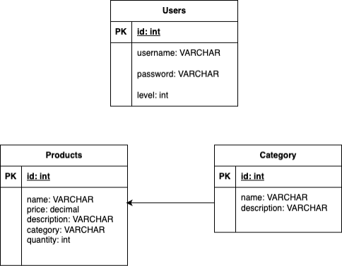
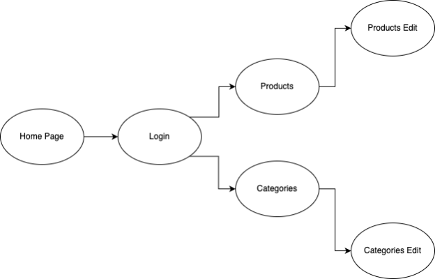
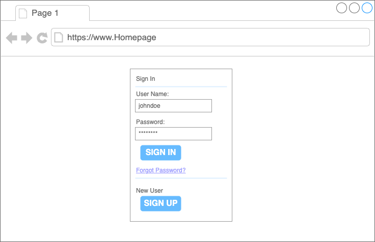
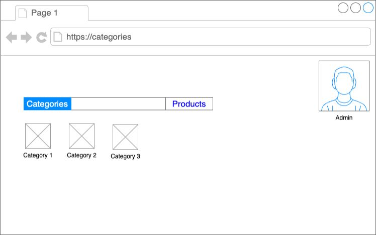
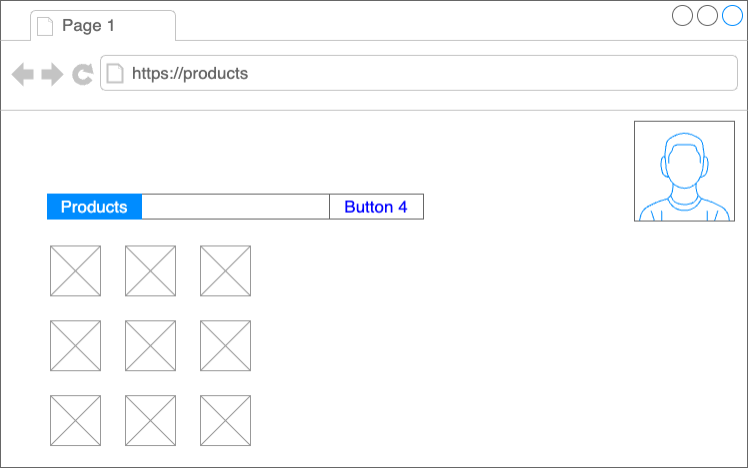
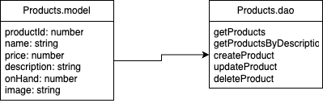

Milestone 4

Ryan Coon

CST-391

Professor Bobby Estey

July 29, 2023

**Screencast URL**

**Introduction:**

The application I will be making for this class is a Product Management System similar to a POS sales system with inventory options. This application will allow users to perform CRUD operations on products that are represented as objects with multiple properties. This system will consist of back-end services developed using Express and Node.js. There will be 2 versions of the front end with one being developed with Angular, and the second being developed with React.

**Functionality Requirements:**

- As a user, I want to be able to view a list of products so I can see what products are offered/available.
- As a user, I want to be able to view a list of categories so that I can see how the products are organized.
- As a user, I want to be able to create a new category so that I can group products based on their similarities and characteristics.
- As a user, I want to be able to edit an existing category so that I can edit its properties if needed.
- As a user, I want to be able to delete a category if no longer needed.
- As a user, I want to be able to view the product details, including the properties and associated category.
- As a user, I want to be able to view details of the categories including its properties and the list of associated products.

**Initial Database Design:**

**Initial UI Sitemap:**

**Initial UI Wireframes:**

**Initial UML Classes:**

- **Products:**

Properties: id:int, name:string, price:decimal, description:string, category:string, quantity:int

Methods: getId, setId, getName, setName, getPrice, setPrice, getDescription, setDescription, getCategory, setCategory, getQuantity, setQuantity

- **DatabaseConnection:**

Methods: connect(), disconnect(), executeQuery(), executeUpdate()

- **ProductController:**

**Methods:** getAllProducts(), getProductById(id), getProductByDescription(), createProduct(product), updateProduct(product), deleteProduct(id)

**Risks:**

This project will utilize a design report to identify and track the unknowns and risks that may arise during its development. This would ensure that we have the proper mitigation strategies in place and can be addressed effectively. This design report will contain the actions and document all of the technical decisions and designs, including UML diagrams, ER diagrams, UI designs, and all other necessary artifacts, including installation setup, to support the application design and end-to-end solution.

**API Endpoints**

- GET /api/products: Retrieves a list of all products in the system.
- POST /api/products: Creates a new product based on the provided data in the request body.
- PUT /api/product/:id: Updates the product with the specified ID using the data provided in the request body.
- DELETE /api/product/:id: Deletes the product with the specified ID from the system.

**Rest API**

Get list of products offered.
get /products/

Get list of products by id.
get /products?productId=id

Get list of products by description.
get /products/search

Create a new product.
post /products/
"name":string,
"price":number,
"description":string,
"onHand":number
"image":string

Update an existing product.
put /products/
"productId":productId,
"name":string,
"price":number,
"description":string,
"onHand":number
"image":string

Delete a product by Id.
delete /products/id

**Powerpoint Document URL**

**Current Homepage**
